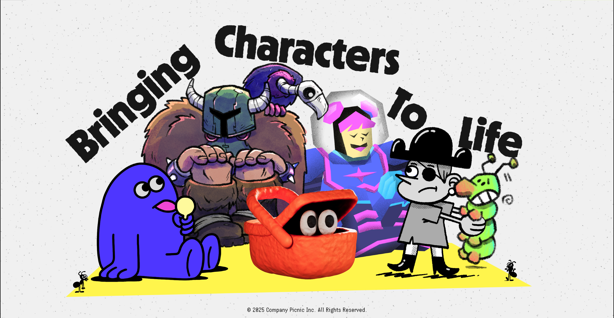

---

# Unity iOS Native Plugins Collection

Your Swiss Army knife for Unity iOS development! 🛠️

This is a collection of iOS native plugins that make Unity talk to iOS like they're old friends. Built with Swift + Objective-C++ bridges, these plugins handle all the messy Xcode configuration automatically so you can focus on making cool stuff.

## 📦 Available Plugins

### 1. Hello World Plugin

**Package**: `com.ursula.unity-ios-library-hello-world`  
**Path**: [`unity-ios-library-hello-world/`](./unity-ios-library-hello-world/)

The "training wheels" plugin! 🚴 This is your starting point to understand how Unity and Swift shake hands. It's super minimal but shows you the entire flow from C# to native code and back. Perfect for learning or as a template when you want to build your own custom native wizardry.

**Features**:

- Basic Swift → Unity communication (say hello!)
- Unity → Swift messaging via `UnitySendMessage`
- Safe string marshaling (no memory leaks here!)
- Automatic Xcode postprocessing (set it and forget it)

[View Documentation →](./unity-ios-library-hello-world/README.md)

---

### 2. Audio Session Plugin

**Package**: `com.copicnic.unity-ios-lib-audio-session`  
**Path**: [`unity-ios-lib-audio-session/`](./unity-ios-lib-audio-session/)

Comprehensive iOS audio session management with AVAudioSession configuration, route detection, and interruption handling.

**Features**:

- Centralized AVAudioSession configuration (categories, modes, options)
- Audio route detection (speaker, headphones, Bluetooth)
- Output volume monitoring and mute state detection
- Interruption and silence hint notifications
- Main-thread Unity callbacks

**Use Cases**: Voice chat apps, audio recording, music players, VoIP integration

[View Documentation →](./unity-ios-lib-audio-session/README.md)

---

### 3. Camera Plugin

**Package**: `com.copicnic.unity-ios-lib-camera`  
**Path**: [`unity-ios-lib-camera/`](./unity-ios-lib-camera/)

Native iOS camera and photo library integration with automatic permission handling and image processing.

**Features**:

- System camera UI for selfie/photo capture
- Photo library picker integration
- Camera permission handling
- Native image resizing and JPEG compression
- Automatic temp file cleanup
- Direct Texture2D loading in Unity

**Use Cases**: Profile pictures, photo sharing, AR filters, in-game photography

[View Documentation →](./unity-ios-lib-camera/README.md)

---

### 4. Custom View Plugin

**Package**: `com.ursula.unity-ios-lib-custom-view`  
**Path**: [`unity-ios-lib-custom-view/`](./unity-ios-lib-custom-view/)

Overlay transparent SwiftUI views on top of Unity's rendering for native UI components and text input.

**Features**:

- SwiftUI overlay on Unity GL view
- Native TextField with iOS keyboard
- Custom buttons with callbacks
- Keyboard-aware layout adjustments
- Bidirectional Unity ↔ SwiftUI communication

**Use Cases**: Native text input, login forms, chat interfaces, native UI over Unity

[View Documentation →](./unity-ios-lib-custom-view/README.md)

---

### 5. Speech Recognition Plugin

**Package**: `com.copicnic.unity-ios-lib-speech`  
**Path**: [`unity-ios-lib-speech/`](./unity-ios-lib-speech/)

On-device speech-to-text using Apple's Speech framework with real-time transcription and multi-language support.

**Features**:

- On-device speech recognition (SFSpeech framework)
- Real-time partial and final results
- Multi-language support (50+ languages)
- Permission handling (Speech + Microphone)
- Main-thread Unity callbacks
- Configurable logging

**Use Cases**: Voice commands, dictation, accessibility features, language learning apps

[View Documentation →](./unity-ios-lib-speech/README.md)

---

## 🏗️ Architecture

All plugins follow a consistent, proven architecture:

```
C# Wrapper (Unity)
    ↕ DllImport("__Internal")
Objective-C++ Bridge (.mm)
    ↕ Swift Interop
Swift Native Code
```

**Key Components**:

- **Runtime/**: C# API with `#if UNITY_IOS` guards for Editor compatibility
- **Plugins/iOS/Source/**: Native Swift implementation + Objective-C++ bridge
- **Plugins/iOS/Editor/**: Postprocessor for automatic Xcode configuration
- **UnityFramework.modulemap**: Enables Swift ↔ UnityFramework symbol resolution

**Benefits**:

- ✅ Zero manual Xcode configuration
- ✅ Debuggable Swift code (breakpoints work!)
- ✅ Safe memory management
- ✅ Editor-safe (stubs for non-iOS builds)
- ✅ Scalable and maintainable

---

## 🚀 Quick Start

### Prerequisites

- Unity 2019.4+ with iOS Build Support
- Xcode (latest stable recommended)
- macOS for iOS builds

### Installation

Each plugin can be installed independently using one of two methods:

**Option A: Unity Package Manager (Recommended)**

1. Open Unity → Window → Package Manager
2. Click **+** → Add package from disk...
3. Navigate to the plugin folder (e.g., `unity-ios-lib-audio-session/`)
4. Select `package.json`

**Option B: Copy to Assets**

1. Copy the plugin folder into your project's `Assets/` directory
2. Unity will auto-import (e.g., `Assets/Plugins/UnityIOSAudioSession/`)

### Unity Project Configuration

For all plugins to work correctly, ensure:

- **Platform**: iOS (File → Build Settings → iOS)
- **Scripting Backend**: IL2CPP (Player Settings → Other Settings)
- **Architecture**: ARM64

---

## 📖 Usage Example

### Audio Session

```csharp
using CoPicnic.IOS.Audio;
using UnityEngine;

public class AudioManager : MonoBehaviour
{
    void Start()
    {
        AudioSessionPlugin.Setup(
            AudioSessionPlugin.Category.PlayAndRecord,
            AudioSessionPlugin.Mode.VoiceChat,
            AudioSessionPlugin.Options.DefaultToSpeaker
        );
        AudioSessionPlugin.Activate();

        AudioSessionPlugin.OnRouteChanged += (reason, route) =>
        {
            Debug.Log($"Audio route changed: {reason}");
        };
    }
}
```

### Camera

```csharp
using CoPicnic.IOS.Camera;
using UnityEngine;

public class ProfilePicture : MonoBehaviour
{
    void Start()
    {
        CameraPlugin.OnImageCaptured += (texture) =>
        {
            GetComponent<Renderer>().material.mainTexture = texture;
        };

        CameraPlugin.OnError += (error) => Debug.LogError(error);
    }

    public void TakePhoto()
    {
        CameraPlugin.OpenCamera(maxSize: 1024, quality: 85);
    }
}
```

### Speech Recognition

```csharp
using CoPicnic.IOS.Speech;
using UnityEngine;
using UnityEngine.UI;

public class VoiceInput : MonoBehaviour
{
    [SerializeField] private Text transcriptionText;

    void Start()
    {
        SpeechPlugin.RequestPermission((granted) =>
        {
            if (!granted) return;

            SpeechPlugin.OnPartialResult += text => transcriptionText.text = text;
            SpeechPlugin.OnFinalResult += text => Debug.Log("Final: " + text);
            SpeechPlugin.StartRecognition("en-US");
        });
    }
}
```

### Custom View (SwiftUI Overlay)

```csharp
using Ursula.IOS.CustomView;
using UnityEngine;

public class LoginScreen : MonoBehaviour
{
    void Start()
    {
        CustomViewPlugin.OnTextSubmitted += (text) =>
        {
            Debug.Log("User entered: " + text);
            CustomViewPlugin.Dismiss();
        };

        CustomViewPlugin.Show();
    }
}
```

---

## 🔧 Build & Run

1. **Configure your scene**:

   - Add the plugin C# scripts to GameObjects
   - Test in Unity Editor (stubs will run)

2. **Build for iOS**:

   - File → Build Settings → iOS
   - Click "Build" or "Build and Run"

3. **Xcode setup** (automatic):

   - Postprocessors configure everything:
     - `DEFINES_MODULE = YES`
     - `MODULEMAP_FILE` points to `UnityFramework.modulemap`
     - Unity headers marked as Public
     - Swift standard libraries embedded

4. **Deploy**:
   - Select your Development Team
   - Choose target device or simulator
   - Run from Xcode (⌘R)

---

## 🧪 Testing

### In Unity Editor

All plugins provide stub implementations for the Editor:

- `#if UNITY_IOS && !UNITY_EDITOR` guards prevent native calls
- Methods return mock data or safe defaults
- No crashes when testing scripts in Editor

### On Device

For real testing:

1. Build to iOS device or simulator
2. Check Xcode console for native logs
3. Set breakpoints in Swift code for debugging
4. Use Unity's device logs (Xcode → Window → Devices and Simulators)

---

## 📁 Project Structure

```
unity-ios-plugins/
├── README.md                          # This file
├── LICENSE                            # MIT License
├── docs/                              # Documentation assets
│   └── imgs/
│       ├── header.png
│       └── footer.png
├── unity-ios-library-hello-world/     # Foundation plugin
├── unity-ios-lib-audio-session/       # Audio session management
├── unity-ios-lib-camera/              # Camera & photo library
├── unity-ios-lib-custom-view/         # SwiftUI overlays
└── unity-ios-lib-speech/              # Speech recognition
```

Each plugin follows this internal structure:

```
plugin-name/
├── package.json                       # UPM metadata
├── README.md                          # Plugin-specific docs
├── Runtime/                           # C# API
│   ├── PluginName.cs
│   └── *.asmdef
└── Plugins/iOS/
    ├── Source/                        # Native code
    │   ├── Implementation.swift
    │   ├── Bridge.mm
    │   └── UnityFramework.modulemap
    └── Editor/                        # Build automation
        └── PostProcess.cs
```

---

## 🤝 Contributing

These plugins are designed to be:

- **Modular**: Use only what you need
- **Extensible**: Easy to add new features following the established pattern
- **Production-ready**: Used in real apps with proper error handling

To extend or create new plugins:

1. Start with `unity-ios-library-hello-world` as a template
2. Add your Swift implementation
3. Expose methods via the Objective-C++ bridge
4. Create C# wrapper with proper marshaling
5. Update postprocessor if adding new frameworks

---

## 📄 License

This project is licensed under the MIT License - see the [LICENSE](./LICENSE) file for details.

```
MIT License
Copyright (c) 2025 Company Picnic

Permission is hereby granted, free of charge, to any person obtaining a copy
of this software and associated documentation files (the "Software"), to deal
in the Software without restriction...
```

---

## 🔗 References

- [Unity iOS Native Plugins Guide](https://docs.unity3d.com/Manual/PluginsForIOS.html)
- [Swift-Unity Integration (unity-swift)](https://github.com/Robert-96/unity-swift)
- [Apple's Speech Framework](https://developer.apple.com/documentation/speech)
- [AVAudioSession Documentation](https://developer.apple.com/documentation/avfaudio/avaudiosession)
- [SwiftUI Documentation](https://developer.apple.com/documentation/swiftui)

---

## 📧 Support

For issues, questions, or contributions:

- **CoPicnic Plugins**: dev@copicnic.com
- **Ursula Plugins**: dev@example.com

---


